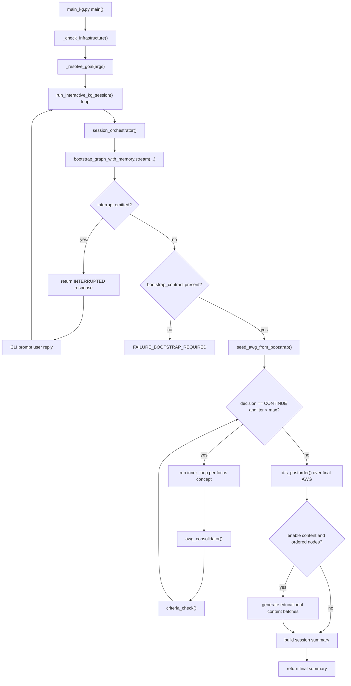
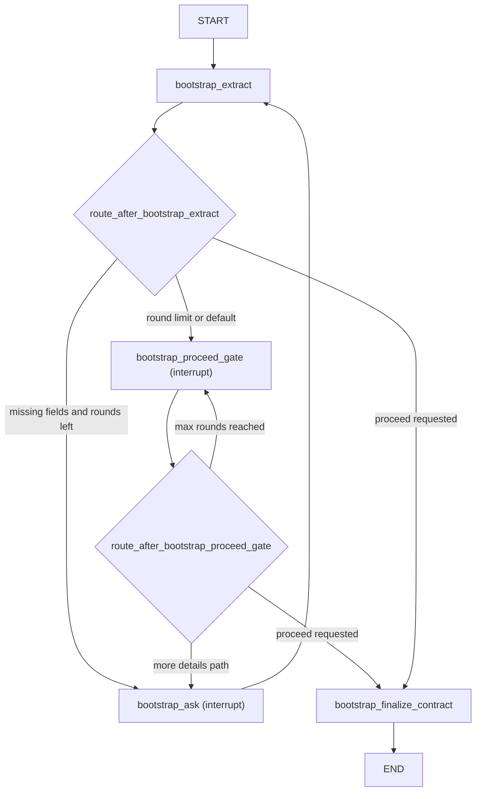
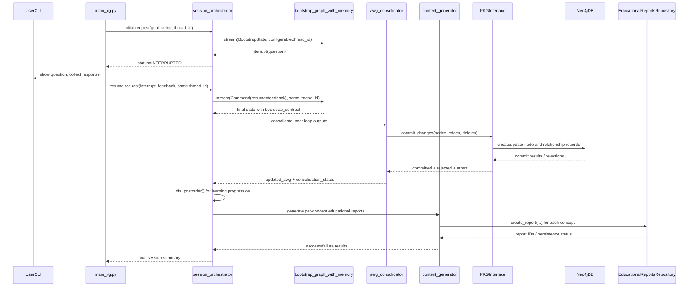

# Runtime Diagrams

Last reviewed: 2026-03-18  
Scope: interactive runtime path only

## 1) Global Interactive KG Flow

## 2) Bootstrap State Machine

## 3) Concept Research Graph (Per Focus Concept)

```mermaid
flowchart TD
    startCR["START"] --> initialProfile["initial_profile_research"]
    initialProfile --> routeAction1{"route_after_action"}
    routeAction1 --> webSearch1["web_search"]
    routeAction1 --> contentExtract1["content_extractor"]
    routeAction1 --> collect1["collect_research"]
    webSearch1 --> collect1
    contentExtract1 --> collect1

    collect1 --> routeResearch1{"route_after_research"}
    routeResearch1 --> proposeProfile["propose_profile"]
    proposeProfile --> evalProfile["evaluate_profile"]
    evalProfile --> profileDone{"profile_completed"}
    profileDone -->|incomplete| actionProfile["action_profile"]
    actionProfile --> routeAction1
    profileDone -->|complete| relatedNode["get_related_concepts"]

    relatedNode --> routeRelated{"route_after_related"}
    routeRelated --> inferRel["infer_relationship"]
    routeRelated --> mergeRelated["merge_related_concepts"]
    inferRel --> mergeRelated

    mergeRelated --> personalizationRouter{"route_after_personalization_router"}
    personalizationRouter -->|no request| initPrereq["initial_prerequisite_research"]
    personalizationRouter -->|has request| pPre["personalization_preprocess"]
    pPre --> pFit["personalization_fit"]
    pFit --> pMode["personalization_mode"]
    pMode --> pDelivery["personalization_delivery"]
    pDelivery --> pAssess["personalization_assessment"]
    pAssess --> pPolicy["personalization_prereq_policy"]

    pPolicy --> policyRoute{"route_after_personalization_prereq_policy"}
    policyRoute -->|stop| mergePrereq["merge_prerequisites"]
    policyRoute -->|expand/limit| initPrereq

    initPrereq --> routeAction2{"route_after_action"}
    routeAction2 --> webSearch2["web_search"]
    routeAction2 --> contentExtract2["content_extractor"]
    routeAction2 --> collect2["collect_research"]
    webSearch2 --> collect2
    contentExtract2 --> collect2

    collect2 --> routeResearch2{"route_after_research"}
    routeResearch2 --> proposePrereq["propose_prerequisites"]
    proposePrereq --> evalPrereq["evaluate_prerequisites"]
    evalPrereq --> prereqDone{"prerequisites_completed"}
    prereqDone -->|incomplete| actionPrereq["action_prerequisites"]
    actionPrereq --> routeAction2
    prereqDone -->|complete| mergePrereq

    mergePrereq --> endCR["END"]
```

## 4) Commit and Resume Sequence

## Related Modules

- [Runtime Index Home](../README.md)
- [Entry Point and Interactive Loop](../01-entrypoint-and-interactive-loop.md)
- [Bootstrap State Machine](../02-bootstrap-state-machine.md)
- [Commit Paths and Checkpointing](../07-commit-paths-neo4j-and-session-checkpointing.md)
- [Post-Expansion Ordering and Content Generation](../10-post-expansion-ordering-and-content-generation.md)
